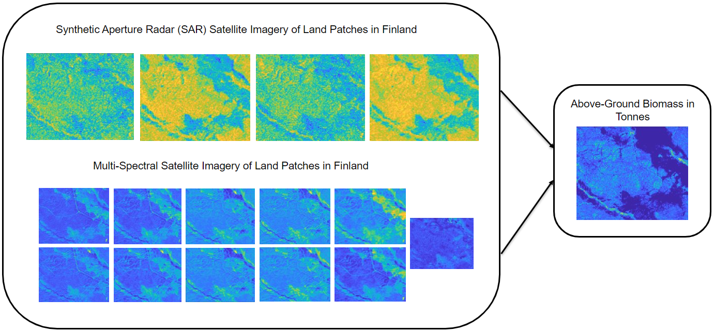

# Biomass Estimation with Satellite Imagery: DrivenData&trade; Challenge Starter Code
<!-- This is the "Title of the contribution" that was approved during the Community Contribution Review Process --> 

  
<!-- Add this icon to the README if this repo also appears on File Exchange via the "Connect to GitHub" feature --> 

This repository serves as a starting solution to The Biomassters competition using MATLAB&reg;. This example takes users through importing and preprocessing satellite imagery, creating an image-to-image regression model that predicts above-ground biomass, using this model to predict on a new dataset, and exporting the results. 

<!--- If your project includes a visualation or any images or an App please include a screenshot in this README --->

<!--- Markdown supports the following HTML entities: © - &copy;  ® - &reg;  ™ - &trade;
More information about Trademarks can be found internally within the Checklist for Community Contributions and Supportfiles Confluence page--->

## Setup 
To Run in MATLAB&reg; Online&trade;, click here: 
 

To Run in MATLAB Desktop:
1. Open ``BiomassEstimationStarter2022.mlx`` in MATLAB or MATLAB Online. 
*Note: To access this file you will have to download it or clone this repository*
2. Follow along with the instructions in the file.

### MathWorks&reg; Products (https://www.mathworks.com)

- [Deep Learning Toolbox&trade; product](https://www.mathworks.com/products/deep-learning.html)
- [Computer Vision Toolbox&trade; product](https://www.mathworks.com/products/computer-vision.html)

Please note that this example was developed using MATLAB release R2022a

## License
<!--- Make sure you have a License.txt within your Repo --->
The license is available in the License file within this repository

Copyright 2022 The MathWorks, Inc.

<!--- Do not forget to the add the SECURITY.md to this repo --->
